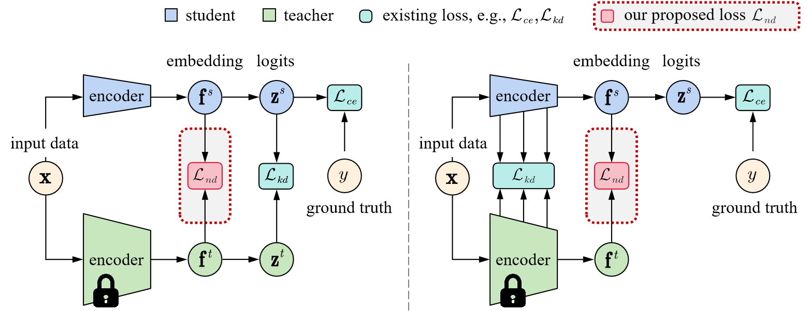
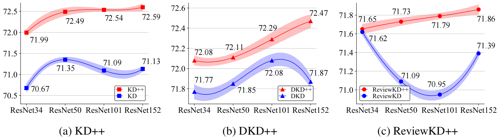

# Improving Knowledge Distillation via Regularizing Feature Norm and Direction
Pytorch implementation for the paper: [Improving Knowledge Distillation via Regularizing Feature Norm and Direction](https://arxiv.org/abs/2305.17007).

## 0. Framework

<div style="text-align:center"></div>

The ND loss, that regularizes the Norm and Direction of the student features, be applyed the embedding features, which is defined as the output at the penultimate layer before logits.

## 1. Main Results

### 1.1 CIFAR-100
| Teacher <br> Student |ResNet-56 <br> ResNet-20|WRN-40-2 <br> WRN-40-1| ResNet-32x4 <br> ResNet-8x4| ResNet-50 <br> MobileNet-V2| ResNet-32x4 <br> shuffleNet-V1 | ResNet-32x4 <br> shuffleNet-V2 |
|:---------------:|:-----------------:|:-----------------:|:-----------------:|:------------------:|:------------------:|:--------------------:|
| Teacher | 72.34 | 75.61 | 79.42 | 79.34 | 79.42 | 79.42 |
| Student | 69.06 | 71.98 | 72.50 | 64.60 | 70.50 | 71.82 |
| KD   | 70.66 | 73.54 | 73.33 | 67.65 | 74.07 | 74.45 |
| DIST | 71.78 | 74.42 | 75.79 | 69.17 | 75.23 | 76.08 |
| DKD  | 71.97 | 74.81 | 75.44* | 70.35 | 76.45 | 77.07 |
| ReviewKD | 71.89 | 75.09 | 75.63 | 69.89 | 77.45 | 77.78 |
| **KD++** | **72.53**(+1.87) | 74.59(+1.05) | 75.54(+2.21) | 70.10(+2.35) | 75.45(+1.38) | 76.42(+1.97) |
| **DIST++** | 72.52(0.74) | 75.00(+0.58) | 76.13(+0.34) | 69.80(+0.63) | 75.60(+0.37) | 76.64(+0.56) |
| **DKD++** | 72.16(+0.19) | 75.02(+0.21) | **76.28**(+0.84) | **70.82**(+0.47) | 77.11(+0.66) | 77.49(+0.42) |
| **ReviewKD++** | 72.05(+0.16) | **75.66**(+0.57) | 76.07(+0.44) | 70.45(+0.56) | **77.68**(+0.23) | 77.93(+0.15) |

  ** represents our reproduced based on the official code [DKD](https://github.com/megvii-research/mdistiller).

### 1.2 ImageNet-1k
 - Comparisons with State-of-the-art Results

| T $\rightarrow$ S   | T (S) | CRD | SRRL| ReviewKD | KD | DKD | **KD++** | **ReviewKD++** | **DKD++** |
|:-----------------:|:-----------------:|:-----------------:|:------------------:|:------------------:|:--------------------:|:--------------------:|:------------------:|:--------------------:|:--------------------:|
|R34 $\rightarrow$ R18 | 73.31 (69.76) | 71.17 | 71.73 | 71.62 | 70.66 | 71.70 | 71.98 | 71.64 | **72.07** |
|R50 $\rightarrow$ MV1 | 76.16 (68.87) | 71.37 | 72.49 | 72.56 | 70.50 | 72.05 | 72.77 | **72.96** | 72.63 |

 - Benefit from larger teacher models
 
 With the teacher capacity increasing, KD++, DKD++ and ReviewKD++ (red) is able to learn better distillation results, even though the original distillation frameworks (blue) suffers from degradation problems. The student is ResNet-18, and reported the Top-1 accuracy (%) on the ImageNet validation set. All results are the average over 5 trials.
<div style="text-align:center"></div>

- Distillation between CNN and Transformer
  - ViT $\rightarrow$ ResNet

    | student | teacher | student | teacher | KD | DKD | **KD++** | **DKD++** |
    |:-----------------:|:-----------------:|:-----------------:|:------------------:|:------------------:|:--------------------:|:--------------------:|:------------------:|
    |Res-18 | ViT-S | 69.76 | 74.64 | 71.32 | 71.21 | **71.46** | 71.33 |
    |Res-18 | ViT-B | 69.76 | 78.00 | 71.63 | 71.62 | **71.84** | 71.69 |

  - CNN $\rightarrow$ ViT
   
    We follow the design of [DeiT](https://arxiv.org/abs/2012.12877): add a distillation token to the input sequences, and use the mean of `cls token` and `dis token` to evaluating. We add ND loss to this framework to improve performance of distillation.

    | student | teacher | student | teacher | DeiT | **DeiT++** | checkpoint |
    |:-----------------:|:-----------------:|:-----------------:|:------------------:|:------------------:|:--------------------:|:--------------------:|
    |DeiT-B | RegNetY-16GF | 81.8 | 82.9 | 83.4 | 83.6 ||
    
    `Notes`

      - The distillation hyper-parameters are slightly different from the original [DeiT](https://arxiv.org/abs/2012.12877). We provide recipe as shown in the table:<div style="text-align:center"></div> The recipe follow [MAE](https://arxiv.org/abs/2111.06377), expect `batch size`, because lack gpu, so these parameters are not tuned. When using this recipe without ND, a distillation result of 83.35 is obtained, similar to DeiT.

      - The distillation process is very slow, it takes about 6.5 days to train on 4*A100, and half as slow as training ViT-b without distillation.


## 2. Training and Evaluation

### 2.1 CIFAR-100 Classification

Please refer to [CIFAR](https://github.com/WangYZ1608/Knowledge-Distillation-via-ND/tree/main/CIFAR) for more details.

### 2.2 ImageNet Classification

Please refer to [ImageNet](https://github.com/WangYZ1608/Knowledge-Distillation-via-ND/tree/main/ImageNet) for more details.

### 2.3  COCO Detection

Please refer to [Detection](https://github.com/WangYZ1608/Knowledge-Distillation-via-ND/tree/main/Detection) for more details.

## 3. Citation
If you use ND in your research, please consider citing:
```BibTeX
@misc{wang2023improving,
      title={Improving Knowledge Distillation via Regularizing Feature Norm and Direction}, 
      author={Yuzhu Wang and Lechao Cheng and Manni Duan and Yongheng Wang and Zunlei Feng and Shu Kong},
      year={2023},
      eprint={2305.17007},
      archivePrefix={arXiv},
      primaryClass={cs.CV}
}
```